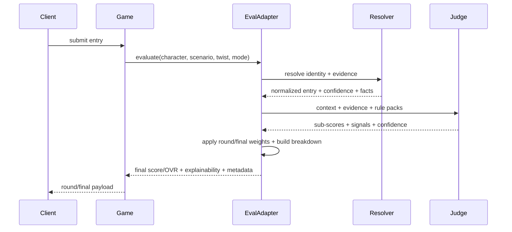

# FREE Context Core Migration Plan (AI-Like Without Live AI)

## 1) Decision (Final Direction)
After two large LLM-first attempts, the live AI runtime path is not a good fit for this project under the real constraints:

1. FREE
2. Fast (5-10s target load windows)
3. Smooth on local/dev hardware and Railway-hosted gameplay
4. Reliable under multiple users/rooms
5. Easy to edit and improve

Final decision:
1. Do not use a live LLM (Ollama or otherwise) in the critical round/final evaluation path.
2. Build a deterministic Context Engine that feels AI-like because it is contextual, not because it uses an LLM.
3. Keep external fetching for facts/images, but make judgment local, structured, cached, and benchmarked.

This is the best path for your requirements.

## 2) Why the LLM Path Failed (Important Postmortem)
Observed across the recent attempts:

1. Local models were too slow for live match pacing.
2. Multi-item batching was unreliable on small free models (often returned 1 row out of many).
3. Timeouts caused fallback/neutral outputs, which made results look fake/random.
4. Server stress and memory/CPU pressure increased significantly.
5. Debugging quality became harder because "AI path active" did not guarantee good contextual evaluation.

Conclusion:
- The problem is not only implementation quality.
- The constraint set (free + fast + live + local + multi-user) makes LLM runtime a poor primary engine for this game right now.

## 3) What To Build Instead (The New Core)
Build a **Context Engine** with four deterministic stages:

1. Resolver
- Resolve what the entry most likely refers to (character/person/object/animal/concept).
- Use alias tables, typo handling, proxy-reference patterns, and source candidate ranking.

2. Context Parser
- Parse scenario/twist into intents, traits, restrictions, and environmental constraints.
- Example: `DECODE A GRID CRASH` + `WITH ONE SHARED POWER SOURCE` -> engineering/logistics/control/resource scarcity.

3. Context Judge
- Score each entry against the parsed context using local rule packs and fetched evidence.
- Produce sub-scores (scenario fit, twist fit, base ability, rarity, creativity, chemistry input, confidence).

4. Weight + Explain Layer
- Apply your round/final weighting server-side (deterministic).
- Build transparent OVR breakdowns and visible trust indicators.

This gives the "AI-like" feel (contextual judgment) without LLM runtime instability.

## 4) Current Repo Strengths (Keep and Build On)
The repo already has strong building blocks for this approach:

1. `server/evaluator/core/fetchers.js`
- Caching, inflight dedupe, wiki candidate scoring, resolver hints.

2. `server/evaluator/scoring/relevance.js`
- Intent groups, capability traits, twist effect rules, contextual fit logic.

3. `server/evaluator/core/constants.js`
- Large domain lexicon and rule data (traits, intents, twist rules, aliases, franchises).

4. `server/viabilityTestHarness.js`
- Existing benchmark mindset and evaluator audit structure.

These are closer to your real goal than the LLM path.

## 5) New Core Architecture (No LLM Runtime)

```mermaid
flowchart TB
U[Player Entries] --> P[Round / Final Services]
P --> A[entryEvaluationService Adapter]
A --> CE[Context Engine Pipeline]
CE --> R[Resolver]
CE --> C[Context Parser]
CE --> J[Context Judge]
J --> W[Weighting Model]
W --> E[Explainability Payload]
E --> G[Game State + UI Payload]
R --> F[(Wiki / Source Fetch Cache)]
G --> I[Image Lookup (wiki/media)]
```



## 6) Non-Negotiable Requirements (Preserved)
1. FREE runtime (no paid inference API)
2. Very fluid/smooth/fast/responsive gameplay
3. Dynamic and air-tight reasoning system
4. Easy to edit and improve
5. High accuracy without killing server/RAM/game flow
6. Clean structure that compounds over time

This plan is designed around those requirements directly.

## 7) Scoring Model (Keep This, Deterministic Server Weights)
Use your intended weighting system, but compute final score/OVR server-side from sub-scores.

### Round OVR (draft round)
Round weighting should remain deterministic and scenario-led, but the exact split can stay adaptive as the Context Engine matures.
The goal is to avoid overfitting round explanations to one rigid percentage breakdown while preserving consistent server-side scoring.

### Final OVR (round 4)
If final twist exists:
1. Original scenario carryover: 18%
2. Original twist carryover: 14.5%
3. Final scenario fit: 18%
4. Final twist fit: 14.5%
5. Base ability: 25%
6. Other restraints incl. chemistry: 10%

If no final twist:
1. Original scenario carryover: 32.5%
2. Final scenario fit: 32.5%
3. Base ability: 25%
4. Other restraints incl. chemistry: 10%

Rule:
- Previous-round context influence in final must stay fairly significant, but capped (<= 33%).

## 8) New Output Contract (Context Engine Result, Not AI JSON)
The engine should return a strict local result shape like this:

```json
{
  "normalizedName": "Batman",
  "resolution": {
    "source": "wikipedia",
    "confidence": 0.93,
    "detectedDomain": "fictional_character",
    "matchedAlias": true
  },
  "scores": {
    "currentScenarioFit": 78,
    "currentTwistFit": 66,
    "baseAbility": 84,
    "rarity": 58,
    "creativity": 52,
    "chemistry": 50,
    "originalScenarioFit": 71,
    "originalTwistFit": 60
  },
  "confidence": {
    "overall": 0.82,
    "nameResolution": 0.93,
    "contextFit": 0.75
  },
  "signals": {
    "matchedTraits": ["intelligence", "stealth", "engineering"],
    "matchedIntents": ["engineering", "infrastructure"],
    "riskFlags": []
  },
  "imageQuery": "Batman"
}
```

Server rules:
1. Clamp sub-scores to 0-100.
2. Recompute final score and OVR server-side.
3. Keep confidence explicit and visible.
4. Always expose why/how flags for debugging and trust.

## 9) Performance Strategy (How 5-10s Becomes Realistic)
This is the key reason this plan works better.

### What changes
1. No live LLM inference.
2. No prompt generation/parsing overhead.
3. No model queue collapse/timeouts.
4. Most work becomes string processing + cached fetch + deterministic scoring.

### Performance plan
1. Batch fetch identities/evidence per round.
2. Cache by `(normalizedEntry, context-free evidence)` and `(entry + scenario + twist + mode)`.
3. Reuse round 1-3 evidence in Round 4 (only re-score context).
4. Fetch images last and only once per normalized entity.
5. Precompute during voting (safe once engine is deterministic and cheap).

Expected result:
- Dramatic latency improvement versus LLM path
- Much lower RAM/CPU variability
- More consistent output under load

## 10) Structural Masterpiece Goal (How We Keep It Easy to Edit)
The system must be data-driven, not hardcoded everywhere.

### Rule Pack model
Keep judgment logic compact by moving tunable behavior into rule packs:
1. Intent keyword packs
2. Trait keyword packs
3. Twist effect packs
4. Domain packs (sports, mythology, cyber, etc.)
5. Rarity/prestige packs
6. Resolver alias/proxy patterns

### Code structure (now scaffolded in repo)
```text
server/
  services/
    entryEvaluationService.js          # stable adapter in use today
    evaluation/
      README.md
      index.js
      contracts/
        resultShape.js
      context/
        parseRoundContext.js
      resolver/
        resolveEntryIdentity.js
        sourceAdapters.js
      scoring/
        weightingModel.js
        contextSignals.js
      pipeline/
        evaluateEntryContext.js
        evaluateEntryBatch.js
      explain/
        buildExplainabilityPayload.js
      cache/
        evaluationCache.js
      diagnostics/
        telemetry.js
      knowledge/
        README.md
  benchmarks/
    contextEngine/
      README.md
      replayHarness.js
```

This is the exact direction for the next session.

## 11) What Was Removed / Rolled Back (This Session)
To reset the project to a safe path:

1. Removed the uncommitted Ollama/LLM prototype runtime files from active development.
2. Restored game flow services and socket/game-engine integrations to the stable baseline commit behavior.
3. Kept a new adapter (`entryEvaluationService`) so future engine migration happens in one place.
4. Added the Context Engine scaffold and benchmark scaffold for the next implementation session.

This gives a clean starting point instead of continuing from a broken runtime path.

## 12) Migration Plan (New, Practical)

### Phase 0 - Baseline lock and replay fixtures
1. Capture real match snapshots and seeded scenarios.
2. Define success metrics:
- p95 round load time
- resolver accuracy
- ranking consistency
- edge-case failure rate
3. Expand `server/benchmarks/contextEngine/replayHarness.js`.

### Phase 1 - Adapter-first migration (no game-flow churn)
1. Keep `roundEvaluationService` and `round4Service` calling `entryEvaluationService`.
2. Implement `context_shadow` mode in adapter:
- run legacy output
- run new context engine in parallel (log only)
3. Compare deltas offline.

### Phase 2 - Resolver upgrade
1. Split resolver logic from `fetchers.js` into `services/evaluation/resolver/*`.
2. Improve alias/proxy/typo resolution coverage.
3. Add resolver confidence and risk flags.

### Phase 3 - Context parser + judge extraction
1. Move scenario/twist parsing and trait logic into `services/evaluation/context` + `scoring`.
2. Produce strict sub-scores from deterministic rule graph.
3. Keep weighting in `scoring/weightingModel.js`.

### Phase 4 - Explainability and trust indicators
1. Build visible status + confidence + matched-trait indicators in payloads.
2. Add clear fallback/risk flags in OVR breakdown.
3. Ensure users can instantly see if an entry was weakly resolved.

### Phase 5 - Round 4 optimization
1. Reuse rounds 1-3 evidence and base sub-scores.
2. Only recompute final scenario/twist fit + chemistry-sensitive adjustments.
3. Reuse cached images.

### Phase 6 - Switch-over and cleanup
1. Enable `EVAL_ENGINE_MODE=context` in internal testing.
2. Remove obsolete paths only after replay benchmarks pass.
3. Keep legacy evaluator available briefly as a regression oracle.

## 13) What To Keep vs Replace (Current Evaluator)

### Keep / refactor into Context Engine
1. `server/evaluator/core/fetchers.js` (resolver + fetch caching patterns)
2. `server/evaluator/scoring/relevance.js` (intent/trait/twist logic foundation)
3. `server/evaluator/core/constants.js` (as rule packs, trimmed and organized)
4. `server/evaluator/core/validation.js`
5. `server/evaluator/team/chemistryCalculator.js`
6. `server/viabilityTestHarness.js` concepts and coverage philosophy

### Replace over time
1. Monolithic `scoreCharacter` orchestration in `server/evaluator/index.js`
2. Rule logic spread across presentation/scoring layers
3. Ad hoc breakdown generation tied tightly to legacy scoring flow

## 14) Railway / Production Readiness (New Reality)
This plan is much more Railway-friendly than an LLM runtime.

1. No model service required.
2. Lower RAM and CPU pressure.
3. Fewer timeout cascades.
4. Easier horizontal scaling of the Node app.

Readiness checklist:
1. Replay benchmark passes
2. Load benchmark for concurrent rooms passes
3. Precompute and cache hit rates are healthy
4. Round/final p95 latency meets target

## 15) Security Notes
1. Do not store tokens/DNS secrets in tracked markdown or source.
2. Rotate any tokens previously pasted in docs/chat.
3. Keep all secrets in Railway environment variables.

## 16) Future Feature Compatibility (Preserved)
This Context Engine is still compatible with your future vision:

1. Category-first mode (new top-priority constraint in context parser)
2. No-voting mode (pure engine score path)
3. Player-authored scenario/twist mode
4. Final mode selector (`Chaos Final` vs `Draft Synthesis Final`) without evaluator rewrites, because final scoring can switch weighting inputs at the adapter/service layer
5. Dev/test mode with deterministic replay fixtures
6. TV/Jackbox-style mode (same backend scoring, different client UX)

## 17) Next Session Execution Order (Exact Start)
1. Implement `context_shadow` pipeline in `entryEvaluationService.js`.
2. Build resolver extraction from `fetchers.js` into `services/evaluation/resolver/*`.
3. Implement strict sub-score output in `pipeline/evaluateEntryContext.js`.
4. Add replay fixtures + benchmark assertions.
5. Wire explainability payload into existing OVR breakdown fields.
6. Enable small-scale shadow testing.

This is the realistic path to a fast, replayable, editable, high-quality system that behaves like an intelligent evaluator without needing a live LLM.
