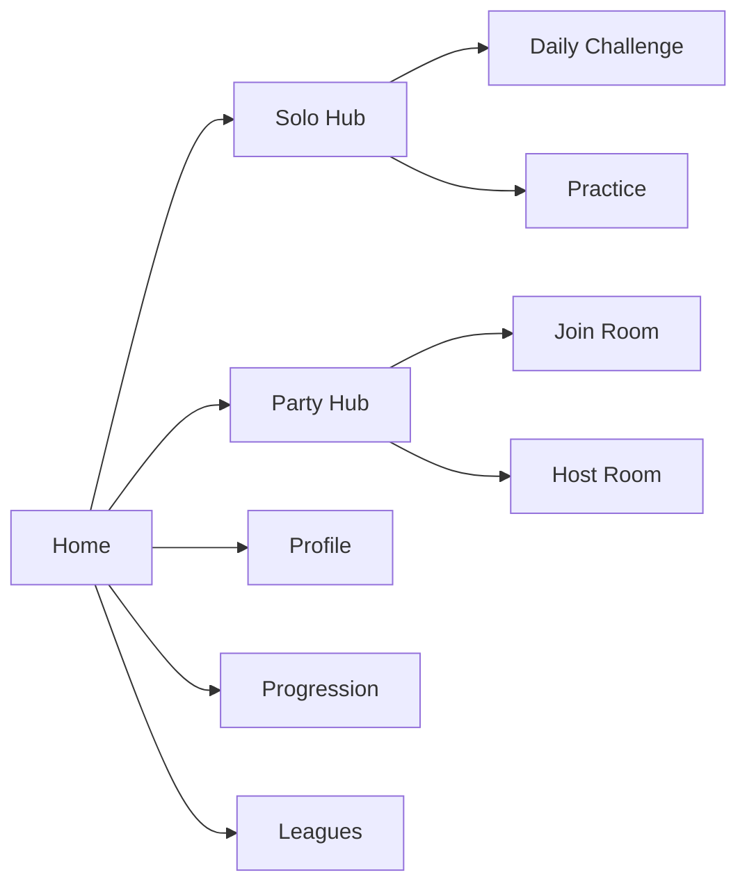
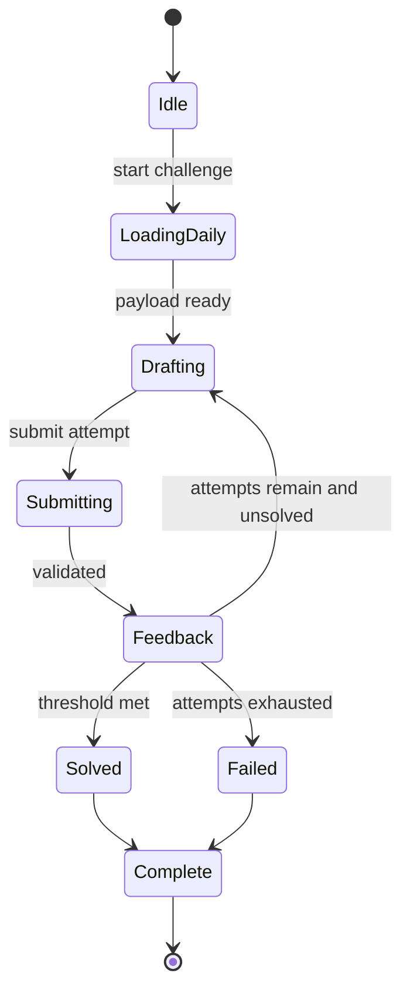
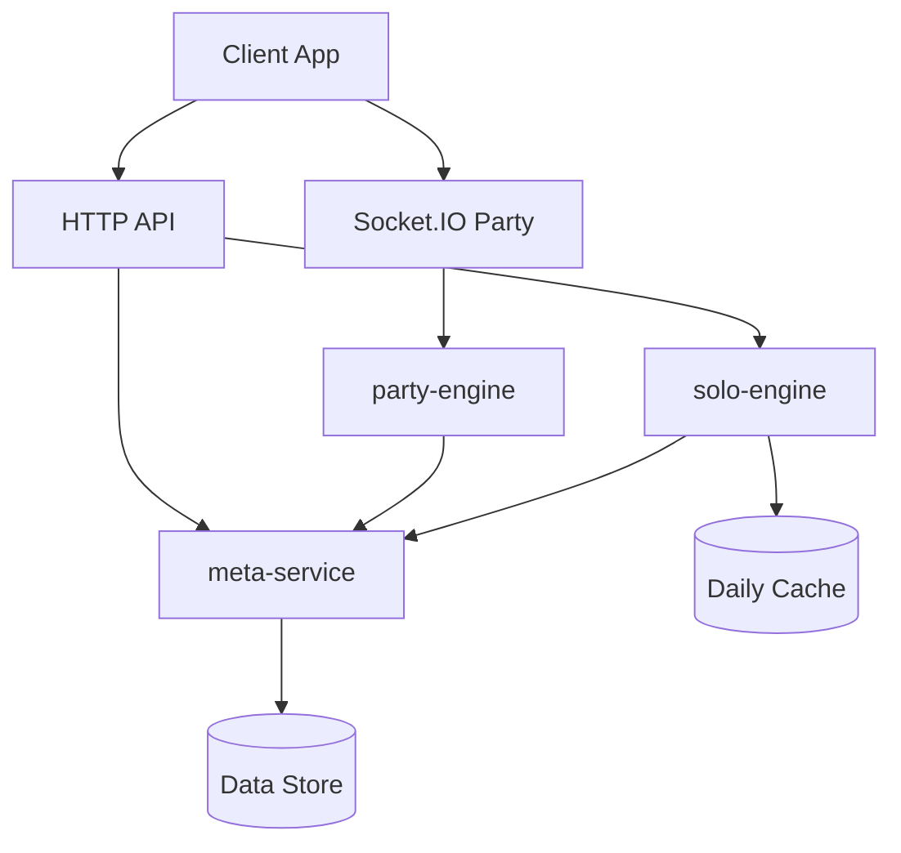

# LobbyWARS Dual-Mode Overhaul Master Plan

Last updated: March 6, 2026

## Objective

Transform LobbyWARS from a multiplayer-first party game with a settings-level single-player toggle into a true dual-product game:

- `Solo Hub`: recurring daily single-player experiences with progression and long-term personal goals.
- `Party Hub`: the existing host/join multiplayer experience, preserved and expanded.

This is a full product redesign, not a feature add.

## Vision Statement

LobbyWARS becomes a game players can open every day even when no friends are online, while still delivering the same social party identity when players want live rooms.

Core identity:

- Daily solo mastery loop.
- Social party chaos loop.
- Shared account progression across both loops.

## Product Pillars

1. `Two complete modes, one account`: Solo and Party have separate gameplay loops but feed a shared profile, XP, achievements, and seasonal systems.
2. `Daily reason to return`: Solo must always provide a fresh challenge every day with deterministic reset behavior.
3. `No multiplayer regression`: Existing server-hosted gameplay remains intact, fast, and reliable.
4. `Clarity over feature bloat`: New systems must be understandable from first launch.
5. `Trustworthy outcomes`: Evaluation/scoring explanations, media fetch quality, and connection reliability are first-class requirements.

## Product Structure

### New Top-Level Information Architecture

- `Landing / Home`
- `Solo Hub`
- `Party Hub`
- `Profile`
- `Progression`
- `Achievements`
- `Leagues`
- `Season Pass / Rewards` (optional for later phase)
- `Settings`

The current single-player settings tab is removed. Solo becomes a standalone entry point in top-level navigation.

### Hub Definitions

- `Solo Hub`: daily mode card(s), streak info, time-to-reset, personal records, quick play entry, and mode history.
- `Party Hub`: existing host/join server flows, chat, custom settings, room lifecycle, and social play.
- `Cross-Mode`: shared level, rank, account cosmetics, achievement tracking, and profile stats.

## Solo Mode Program

### Mode Family Design

Initial launch includes one primary recurring mode (working name: `Daily Cipher Clash`), with architecture ready for additional daily modes later.

Mode principles:

- One global challenge seed per day.
- Everyone plays the same puzzle logic each day.
- Finite attempts or bounded actions.
- Score derives from correctness, efficiency, and strategic choices.
- Strong result shareability without exposing full answer path.

### Daily Cadence Rules

- Daily reset at a fixed canonical UTC time.
- Client displays local countdown to next reset.
- One scored run per account per day per mode.
- Optional unranked practice mirror after completion (no leaderboard credit).

### Anti-Cheat / Fairness Rules

- Seed generation is server-authoritative.
- Submission validation is server-authoritative.
- Any replay/edit attempts after completion route to practice mode.
- Suspicious outlier runs are flagged for review telemetry.

### Solo Progression Hooks

- Daily completion XP.
- Bonus XP for streak milestones.
- Mode-specific mastery badges.
- Personal best tracking and percentile history.
- Weekly and seasonal solo ladders.

## Party (Multiplayer) Continuity and Expansion

The existing gameplay loop remains available and functionally equivalent at overhaul launch:

- Host/join rooms.
- Chat and social interactions.
- Existing rounds and match flow.
- Existing settings behavior.

Expansion after stabilization:

- Party-specific achievement categories.
- Party MMR or league points (opt-in ranked queue or private league events).
- Party seasonal quests tied to participation and sportsmanship.

## Unified Account and Meta Systems

### Account / Identity

- Introduce account identity layer (guest and authenticated).
- Recommend full auth support for cross-device progression.
- Preserve guest quick-start for frictionless first session.

### XP and Levels

- Shared XP pool across Solo and Party.
- XP source buckets include daily solo completion, solo performance tiers, party participation/completion, and party performance/teamwork milestones.
- XP caps and anti-exploit limits per day.

### Achievements

Achievement taxonomy:

- `Solo Mastery`
- `Party Tactics`
- `Social / Community`
- `Collection / Cosmetics`
- `Seasonal`
- `Milestone / Legacy`

Each achievement should include:

- Trigger rule.
- Retroactive eligibility behavior.
- Reward type.
- Visibility rule (public/private showcase).

### Stats and Profile

Profile displays:

- Lifetime and seasonal level.
- Solo stats: streaks, solve rates, average efficiency, top percentile finishes.
- Party stats: matches played, win placements, vote impact, clutch rounds.
- Reliability stats where useful: disconnect rate, completion rate.

### Leagues and Seasons

Design leagues as optional competitive scaffolding:

- Seasonal ladder with tiered divisions.
- Parallel solo and party league tracks.
- Decay and promotion rules.
- End-of-season rewards and badge permanence.

## UX and Visual Redesign Direction

### Experience Goals

- First launch: explain dual-mode structure in under 10 seconds.
- Home screen must clearly answer: "Play solo now?" vs "Play with people?"
- Solo screens prioritize focus and readability.
- Party screens preserve fast room setup and social momentum.

### Screen and Flow Additions

- New onboarding split screen (`Choose Your Path`).
- Solo daily challenge entry and post-run summary.
- Progression center (XP, level rewards, season path).
- Achievements browser and claim interactions.
- League overview and standings.
- Account login/linking flows.

### Design System Overhaul

- Create a reusable design token system for both hubs.
- Shared components: cards, timers, progression bars, achievement chips, leaderboard rows.
- Distinct visual flavor by mode while maintaining one brand identity.

## Technical Architecture Plan

### High-Level Runtime Split

- Keep current Party runtime stable.
- Add dedicated Solo runtime paths and data services.
- Introduce shared Meta service layer for account/progression/achievements.

Logical service domains:

- `party-engine` (existing game engine and socket lifecycle)
- `solo-engine` (daily seed generation, validation, scoring)
- `meta-service` (XP, levels, achievements, profile)
- `identity-service` (guest/auth account mapping)
- `leaderboard-service` (daily/seasonal rankings)

### Data Model Additions

Core entities to add:

- `users`
- `profiles`
- `daily_challenges`
- `daily_attempts`
- `player_progression`
- `achievement_definitions`
- `achievement_unlocks`
- `season_definitions`
- `league_entries`
- `leaderboard_snapshots`
- `session_events` (analytics and reliability telemetry)

### API / Socket Contract Evolution

- Maintain backward compatibility for current Party socket events.
- Add versioned endpoints/events for Solo and Meta systems.
- Use explicit schema validation for all new payloads.
- Add idempotency keys for completion/claim endpoints.

### Migration Strategy

1. Preserve existing multiplayer event contracts during initial rollout.
2. Add account/profile abstraction without breaking guest flow.
3. Release Solo endpoints behind feature flags.
4. Gradually move UI from single-page sections to true hub navigation.
5. Decommission old single-player settings path only after Solo Hub parity is live.

## Quality and Reliability Workstreams (Required)

The following issues are mandatory blockers for full launch:

- Evaluations are not consistently accurate/clear.
- Image/info fetching quality is not reliable enough.
- Current bug volume includes unplayable/inconvenient gameplay and connection issues.

Workstreams:

### Evaluation Trust Program

- Define measurable quality rubric for scoring/explanations.
- Add regression suites on representative scenario datasets.
- Ship confidence and explanation transparency improvements in UI.
- Gate release on score consistency and low-conflict audit outcomes.

### Content Fetch Reliability Program

- Add robust fallback chains for image/info retrieval.
- Improve caching, timeout handling, and retry strategy.
- Add quality ranking and bad-source suppression.
- Monitor fetch success rate and render completeness in production telemetry.

### Stability and Connectivity Program

- Prioritize bug triage on unplayable blockers.
- Harden reconnect and room continuity behavior.
- Add soak/stress testing for peak concurrent sessions.
- Add client diagnostics for failure classification.

## Implementation Phases

### Phase 0: Foundation and Guardrails

- Finalize vision and non-negotiable constraints.
- Define architecture boundaries and migration rules.
- Establish telemetry baseline for current Party mode.
- Freeze risky refactors until test harness is in place.

Exit criteria:

- Signed architecture decision record.
- Baseline reliability dashboard operational.

### Phase 1: Account + Meta Backbone

- Implement user/profile/progression storage and APIs.
- Add guest-to-account linking flow.
- Add XP + level system with feature flag.
- Add achievement framework without front-end exposure yet.

Exit criteria:

- Stable profile reads/writes.
- No Party gameplay regressions from auth/meta integration.

### Phase 2: Solo Engine MVP (Daily Mode)

- Implement daily seed generator and validator.
- Build daily run lifecycle and scoring.
- Add post-run summary and streak tracking.
- Launch internal leaderboard snapshots.

Exit criteria:

- Deterministic daily behavior across timezones/devices.
- End-to-end anti-cheat and idempotent submissions validated.

### Phase 3: Front-End Hub Redesign

- Replace single-player tab with top-level Solo and Party hubs.
- Ship new Home, Profile, Progression, and Achievements screens.
- Update navigation, onboarding, and mode-specific UX language.

Exit criteria:

- First-time user understands both modes without tutorial dependence.
- Existing Party users can still create/join rooms with no extra friction.

### Phase 4: League + Seasonal Layer

- Add season lifecycle and reward tracks.
- Add solo and party league progression.
- Add seasonal quests and milestone rewards.

Exit criteria:

- Season reset and reward scripts verified in staging.
- No data corruption across season boundaries.

### Phase 5: Polish and Launch Readiness

- Close blocker bugs from evaluation/fetch/reliability programs.
- Complete accessibility and mobile performance pass.
- Conduct full regression suite across Solo and Party.

Exit criteria:

- Launch checklist green.
- KPI targets hit in controlled rollout cohort.

## Success Metrics

Primary KPIs:

- Daily active users and daily return rate.
- Solo completion rate and streak retention.
- Party match completion and reconnect success.
- Cross-mode engagement (players who use both hubs weekly).
- Crash-free session rate and critical bug rate.

Quality KPIs:

- Evaluation dispute/override rate.
- Image/info fetch success + quality score.
- Median join-to-play time.

## Risks and Mitigations

- `Risk`: Overhaul delays due to scope expansion.
- `Mitigation`: Strict phase gates and feature flags.

- `Risk`: Multiplayer regressions while adding meta/account systems.
- `Mitigation`: Backward-compatible contracts and dedicated regression suite.

- `Risk`: Solo mode novelty drops after initial launch.
- `Mitigation`: Pipeline for additional daily variants and seasonal modifiers.

- `Risk`: Progression imbalance or exploit loops.
- `Mitigation`: XP caps, server-authoritative scoring, telemetry anomaly detection.

## Immediate Execution Checklist

1. Approve this vision and scope boundaries.
2. Create architecture decision records for dual runtime split and account model.
3. Define Solo daily mode ruleset v1 in a dedicated spec doc.
4. Define XP/level curve and achievement data schema.
5. Build Phase 0 reliability dashboards and blocker bug board.
6. Start Phase 1 implementation behind feature flags.

## Detailed Expansion (March 6, 2026)

This section expands the plan into concrete execution detail for functionality, features, visual direction, performance, and breakage prevention.

## 1) Detailed Step-by-Step Functional Clarification Plan

| Step | Purpose | Detailed work | Locked outputs |
| --- | --- | --- | --- |
| 0 | Program framing | Freeze non-negotiables: two standalone hubs, shared meta progression, no party regressions. Define scope boundaries and explicit out-of-scope list. | Signed scope charter + risk register |
| 1 | Solo gameplay definition | Write exact Daily mode ruleset and feedback language. Define win/loss states, attempts, scoring math, streak logic, hint penalties, share-card behavior. | Solo Mode Spec v1 + scoring formula doc |
| 2 | Party gameplay continuity map | Inventory every multiplayer feature and map action: keep, move, redesign, or expand. Confirm zero-loss behavior at launch. | Party Feature Action Matrix |
| 3 | Cross-mode progression design | Define XP curves, level thresholds, achievement triggers, seasonal cadence, league promotion/decay rules, and anti-exploit caps. | Progression Economy Spec |
| 4 | Information architecture and UX flow | Define Home, Solo, Party, Profile, League flows. Produce wireframes and interaction state diagrams. Validate with first-click tests. | Navigation map + wireframes + flow states |
| 5 | Data and contract design | Define schema, migrations, API contracts, socket compatibility, idempotency rules, and telemetry taxonomy. | ERD + API contract bundle |
| 6 | Vertical slice build | Build Solo daily flow end-to-end (seed, attempt, feedback, scoring, completion, XP, leaderboard write). | Solo vertical slice in staging |
| 7 | Hub split rollout | Introduce top-level Solo/Party structure with feature flags. Keep existing party flow reachable and unchanged. | Dual-hub navigation live behind flag |
| 8 | Progression + social layers | Ship profile, achievements, season track, leagues, and cross-mode reward claims. | Meta systems alpha |
| 9 | Performance hardening | Run load, soak, reconnect, and memory profiling. Remove bottlenecks and enforce budgets. | Performance gate report |
| 10 | Launch safety and rollout | Canary release, kill-switch verification, on-call runbook dry run, rollback drills. | Launch readiness signoff |

### Solo Daily Mode v1: Exact Gameplay Intent

Mode name (working): `Daily Cipher Clash`

Daily challenge package (server-generated at reset):

- `scenario_id`
- `twist_id`
- `candidate_pool` (12 entries)
- `role_slots` (4 slots: `Lead`, `Anchor`, `Wildcard`, `Closer`)
- Hidden scoring vector and threshold

Player run lifecycle:

1. Player opens Solo Hub and starts daily challenge.
2. Client loads candidate pool, scenario brief, and twist.
3. Player drafts 4 entries into the 4 role slots.
4. Player submits attempt.
5. Server returns slot feedback and team-level feedback.
6. Player iterates until solved or attempts exhausted.
7. Result is finalized, XP awarded, leaderboard written, share card generated.

Attempt rules:

- Max attempts: `6`
- Max hint actions: `2`
- One scored daily run per account per day
- Post-completion practice runs are unranked only

Feedback contract per attempt:

- Slot grade: `Perfect`, `Strong`, `Weak`, `Miss`
- Team synergy trend: `Up`, `Flat`, `Down`
- One compact clue line to guide next attempt

Scoring formula (v1 target):

`daily_score = base_quality + attempt_efficiency_bonus + hint_conservation_bonus + streak_bonus`

v1 bounds:

- `base_quality`: 0-100
- `attempt_efficiency_bonus`: 0-20
- `hint_conservation_bonus`: 0-10
- `streak_bonus`: 0-14
- Final clamp: 0-134

Solve conditions:

- `Solved`: score threshold met before attempt limit
- `Failed`: attempt limit reached without threshold
- Both states still grant participation XP, with solve bonuses for threshold clear

### Functional Clarification Artifacts Required Before Build

- Gameplay rules spec with canonical examples
- State machine for every playable state and transition
- JSON payload examples for every API response
- Acceptance tests written in plain language from rules spec
- Edge-case catalog: disconnects, duplicate submits, timezone resets, guest-account linking

## 2) Features to Think About

### 2a) Multiplayer Features: Move, Change, Expand, Add, Redesign

| Multiplayer area | Action | Detailed change |
| --- | --- | --- |
| Host/join room entry | Move + polish | Move to Party Hub home. Keep one-tap create/join speed. Add clearer status badges (`Public`, `Private`, `League`). |
| Settings OS | Redesign | Keep current settings capabilities, but reposition as Party pre-game control center with improved preset system and preview summaries. |
| Core round loop | Keep + instrument | Preserve rounds 1-3 + Round 4 flow; add telemetry and replay markers for regression safety. |
| Chat | Expand | Add quick reactions, mute/report controls, and optional team channels for league events. |
| Connection handling | Expand | Add reconnect grace windows, room rejoin tokens, host migration fallback rules for host disconnects. |
| Match history | Add | Store party match summaries in profile timeline with score breakdown and highlights. |
| Evaluator explainability | Change | Increase post-round clarity for why points moved; standardize confidence labels and risk flags. |
| Audio/voice pipeline | Optimize + simplify controls | Keep current voice system but expose clearer quality toggles and preflight diagnostics in Party settings. |
| League-compatible party play | Add | Add league queue entry rules, party MMR/ELO mapping, and anti-smurf checks. |
| Moderation and abuse prevention | Add | Add report flows, temporary comms cooldowns, and moderation telemetry dashboards. |
| Accessibility in party sessions | Expand | Add scalable text, reduced motion mode, color-safe chips, and subtitle-first narration fallback. |

### 2b) Single-Player Features: Flesh Out, Scale, Simplify, Add

| Single-player area | Action | Detailed change |
| --- | --- | --- |
| Daily challenge core | Flesh out | Lock daily rules, attempts, hints, and score feedback loop before any polish work. |
| Daily reset and timezone behavior | Harden | Use canonical UTC reset with local countdown display and strict server-side date ownership. |
| Hint system | Simplify + tune | Cap hints to prevent trivial solves; keep hint language short and strategically meaningful. |
| Practice mode | Add | Allow unlimited unranked attempts after daily completion to support learning and retention. |
| Archive mode | Add later | Optionally unlock previous daily challenges in historical archive for progression grinding without leaderboard impact. |
| Solo progression | Expand | Add streak tracks, mastery badges, personal records, and seasonal solo milestones. |
| Solo leaderboard slices | Add | Global, friends, and percentile bands; support anti-cheat filtering before rank finalization. |
| Onboarding/tutorial | Add | One short interactive tutorial that teaches feedback grammar (`Perfect/Strong/Weak/Miss`) and scoring logic. |
| Daily content variety | Scale | Rotate challenge archetypes by day-of-week template to reduce repetition. |
| Failure UX | Improve | Failure should still feel rewarding: show what improved, where points were lost, and tomorrow teaser card. |
| Anti-cheat | Harden | Request signing, idempotency, server timestamps, and anomaly detection on impossible solve patterns. |
| Solo accessibility | Expand | High-contrast mode, larger touch targets, no-time-pressure option in practice mode. |

## Shared Cross-Mode Features to Design Early

- Unified account model with guest upgrade path
- Shared XP and level progression with anti-farming limits
- Achievements that can unlock from both hubs
- Seasonal reward claim surfaces
- Unified profile privacy controls

## 3) Visual, UX, Diagrams, and iOS-First Presentation

### Should we use visual diagrams?

Yes. This overhaul requires diagrams to prevent ambiguity and drift.

Required diagram set:

- Information architecture map (Home, Solo, Party, Profile, League)
- Solo state machine (daily run lifecycle)
- Party runtime and socket lifecycle map
- Service/data architecture diagram
- Release rollout swimlane with feature flags and rollback paths

### Visual Direction: Preserve Current Brand, Formalize Tokens

Current palette anchors from `public/css/base.css`:

| Token | Current value | Overhaul use |
| --- | --- | --- |
| `--primary` | `#ff4081` | Primary CTA and highlight actions |
| `--secondary` | `#00bcd4` | Secondary interactive states and accents |
| `--warning` | `#ffc107` | Attention and caution markers |
| `--success` | `#4caf50` | Positive outcomes and solved states |
| `--danger` | `#ff5252` | Errors, destructive actions, disconnect warnings |
| `--gradient-bg` | pink/cyan gradient | Base global atmosphere across hubs |

Typography direction:

- Keep existing playful headline identity.
- Standardize body readability for dense stats and leaderboard content.
- Define consistent scale tokens for mobile-first readability.

Component direction:

- Shared primitives: button, card, chip, stat row, progress bar, modal sheet.
- Solo variants emphasize focus and puzzle readability.
- Party variants emphasize social activity, player presence, and quick controls.

### iOS Excellence Plan (No UI Regression)

Use existing iOS-safe patterns already present in CSS as baseline:

- Continue `env(safe-area-inset-*)` padding model for headers, footers, and sheets.
- Prefer `100dvh` and avoid static `100vh` assumptions where address bar can shift.
- Keep tap targets at or above `44px` minimum.
- Keep reduced-motion and high-contrast media query behavior in all new screens.
- Gate heavy blur/backdrop effects on low-end devices to avoid frame drops.

### Example Diagrams (Source-of-Truth Drafts)







## 4) Loading, Server Stress, Processing, Fluidity, and Memory Plan

### Performance Budgets (Launch Gates)

| Metric | Target |
| --- | --- |
| Home screen interactive (p95, mobile) | <= 2.5s |
| Solo daily load to first interaction (p95) | <= 1.2s |
| Party join handshake complete (p95) | <= 1.0s |
| Daily attempt submit response (p95) | <= 250ms |
| Frame drops during active play | < 1% frames over 16.7ms budget |
| JS heap on iOS Safari during active session | <= 180MB |
| Reconnect recovery success in 10s window | >= 99% |

### Client Performance Strategy

- Split routes by hub so Solo and Party code paths do not load together.
- Lazy-load heavy subsystems (Round 4 cinematic assets, leaderboard history panes).
- Use image source sets and pre-compressed assets.
- Virtualize long lists (leaderboards, achievements) to limit DOM nodes.
- Cap animation layers and avoid expensive filter stacks during gameplay-critical moments.
- Run memory cleanup hooks on screen transitions and room leave events.

### Server and Runtime Stress Strategy

- Isolate `party-engine` realtime load from Solo HTTP workload.
- Precompute and cache daily challenge payloads at reset time.
- Cache deterministic scoring artifacts for repeated candidate evaluations.
- Use idempotent completion endpoints to prevent duplicate writes.
- Add circuit breakers and graceful degradation for non-critical fetchers.
- Separate high-cost content enrichment jobs from request-response path.

### Data and Infra Strategy

- Add indexes for daily lookup keys (`date_key`, `user_id`, `mode_id`).
- Write-through cache for leaderboard reads.
- Batch analytics writes to reduce hot-path I/O pressure.
- Apply expand-contract migration strategy to prevent write downtime.

### Stress and Soak Validation

- Reuse existing benchmark harness discipline in `server/benchmarks`.
- Add synthetic peak tests for concurrent party rooms, daily submission bursts near reset, and reconnect storms after brief network outage.
- Enforce fail-fast performance gates in CI before promotion.

## 5) How to Ensure Nothing Breaks and Execution Stays on Plan

### Release Safety Model

- Every major subsystem behind feature flags (`solo_hub`, `meta_progression`, `league_mode`).
- Use dark launch to production with internal accounts first.
- Canary rollout percentages with real-time SLO watch.
- Keep hard kill-switches to disable new modules without restarts.

### Test Strategy (Required)

| Test type | Coverage goal |
| --- | --- |
| Unit tests | Solo scoring math, progression math, achievement triggers, API validators |
| Contract tests | All socket and HTTP payload schemas with backward compatibility checks |
| Deterministic replay tests | Party round progression and Round 4 results unchanged under same seed |
| Integration tests | Account linking, XP writes, daily completion pipeline |
| E2E tests | Home -> Solo complete flow, Home -> Party complete flow on desktop + iOS viewport |
| Load tests | Room concurrency, burst submission, reconnect recovery |
| Chaos tests | Cache loss, partial service outage, delayed external info/image providers |

### Regression Prevention for Existing Gameplay

- Maintain a locked baseline suite for current party behavior before any hub split merge.
- Record golden-match snapshots and compare outcome parity per build.
- Block release on any scoring, timing, or settings propagation drift.

### Operational Readiness

- Runbook updates per phase, including rollback steps and ownership.
- Dashboards for latency, error rates, reconnect success, and memory growth.
- Alert thresholds tuned for early degradation detection.
- On-call simulation before public rollout.

### Delivery Governance

- Weekly design+engineering sync with explicit decision log.
- Any ruleset change requires spec update and acceptance test update in same PR.
- No phase exit without signed exit criteria and performance/test evidence.

### Definition of Done for Overhaul Launch

- Solo daily mode fully playable and deterministic.
- Party mode preserved with no critical regression.
- Shared progression, achievements, and profile stable.
- iOS and desktop UX validated against accessibility and performance budgets.
- Evaluation clarity, fetch reliability, and stability blocker metrics meet launch thresholds.

## Codex Phase Execution Protocol (Mandatory)

This section is the operational contract that should be followed when prompted:

- `Do the entire phase 0 of this new plan`
- `Do the entire phase 1 of this new plan`
- `Do the entire phase 2 of this new plan`
- `Do the entire phase 3 of this new plan`
- `Do the entire phase 4 of this new plan`
- `Do the entire phase 5 of this new plan`

### Non-Negotiable Execution Rules

1. Scope lock: execute only the requested phase plus mandatory dependencies.
2. No silent skips: every phase ask item must have an explicit result line.
3. Evidence required: each completed task must point to files changed and validation run.
4. No false-complete: if any mandatory item is incomplete, status is `PARTIAL` or `FAILED`.
5. Backward compatibility: no regression to active Party gameplay and socket contracts.
6. Feature-flag first: net-new systems must ship behind flags until phase exit criteria are met.
7. Rollback readiness: each phase must preserve a clear disable/revert path.

### Global Session Workflow (For Every Phase)

1. Restate phase scope from this document.
2. Collect baseline context from current repo state and existing docs.
3. Execute all phase tasks and produce required deliverables.
4. Run mandatory validation commands and summarize key outputs.
5. Evaluate exit criteria with `COMPLETE`, `PARTIAL`, or `FAILED`.
6. Emit the mandatory Ask-vs-Result summary block.

### Mandatory End-of-Session Output Template

Use this exact structure at the end of each phase execution:

```text
ASK: <phase ask item #1>. RESULT: <what was implemented + evidence>
ASK: <phase ask item #2>. RESULT: <what was implemented + evidence>
ASK: <phase ask item #3>. RESULT: <what was implemented + evidence>
ASK: <phase ask item #4>. RESULT: <what was implemented + evidence>

Exit Criteria:
-> <exit criterion #1>. COMPLETE|PARTIAL|FAILED. Evidence: <file/command>
-> <exit criterion #2>. COMPLETE|PARTIAL|FAILED. Evidence: <file/command>

Overall Phase Status: COMPLETE|PARTIAL|FAILED
Blockers (if any): <short list or None>
```

### Evidence Requirements

- `File evidence`: exact paths touched.
- `Behavior evidence`: what behavior changed and where.
- `Validation evidence`: commands executed and key pass/fail summary.
- `Risk evidence`: known residual risks and why they are acceptable (or not).

## Phase Work Orders (Codex-Ready)

These work orders convert each phase into concrete, auditable implementation tasks.

### Phase 0 Work Order: Foundation and Guardrails

Phase asks:

- Finalize vision and non-negotiable constraints.
- Define architecture boundaries and migration rules.
- Establish telemetry baseline for current Party mode.
- Freeze risky refactors until test harness is in place.

Mandatory implementation tasks:

1. Create `md/overhaul/PHASE_0_SCOPE_LOCK.md` with signed non-negotiables and explicit out-of-scope list.
2. Create architecture decisions:
- `md/overhaul/ADR-001-dual-runtime-boundaries.md`
- `md/overhaul/ADR-002-migration-and-feature-flag-strategy.md`
3. Add telemetry baseline spec and event taxonomy:
- `md/overhaul/TELEMETRY_BASELINE_SPEC.md`
- `md/overhaul/TELEMETRY_EVENT_TAXONOMY.md`
4. Add Party baseline telemetry hooks (join, leave, reconnect, room create, phase transition, round completion, final completion) with lightweight server logging adapter.
5. Add baseline telemetry report generation script and produce initial report at `md/overhaul/reports/PHASE_0_TELEMETRY_BASELINE.md`.
6. Add refactor freeze policy and merge gate checklist at `md/overhaul/REFACTOR_FREEZE_POLICY.md` and `md/overhaul/PHASE_GATE_CHECKLIST.md`.

Validation gate:

- Telemetry events emit with valid schema on core Party flow.
- Baseline report is generated from real run data.
- ADRs and scope lock docs are present and internally consistent.

Exit criteria:

- Signed architecture decision record.
- Baseline reliability dashboard operational.

### Phase 1 Work Order: Account + Meta Backbone

Phase asks:

- Implement user/profile/progression storage and APIs.
- Add guest-to-account linking flow.
- Add XP + level system with feature flag.
- Add achievement framework without front-end exposure yet.

Mandatory implementation tasks:

1. Add `identity-service`, `meta-service`, and storage adapters with migration-safe interfaces.
2. Add entities and persistence for `users`, `profiles`, `player_progression`, `achievement_definitions`, and `achievement_unlocks`.
3. Add API contracts and validators for guest session creation, account link/upgrade, profile read/update, and server-authoritative XP grant ledger writes.
4. Implement XP rules with caps and anti-abuse constraints.
5. Implement achievement engine (trigger evaluation + unlock ledger) behind feature flag.
6. Add migration scripts and compatibility fallbacks for existing guest players.
7. Add integration tests for account linking and progression writes.

Validation gate:

- Profile CRUD works for guest and linked users.
- XP grants are idempotent and auditable.
- Existing Party flow functions unchanged when meta flags are disabled.

Exit criteria:

- Stable profile reads/writes.
- No Party gameplay regressions from auth/meta integration.

### Phase 2 Work Order: Solo Engine MVP (Daily Mode)

Phase asks:

- Implement daily seed generator and validator.
- Build daily run lifecycle and scoring.
- Add post-run summary and streak tracking.
- Launch internal leaderboard snapshots.

Mandatory implementation tasks:

1. Add `solo-engine` module with deterministic daily seed keyed by UTC date.
2. Implement daily challenge payload generator and server-authoritative attempt validator.
3. Implement run lifecycle endpoints for start run, submit attempt, request hint, and finalize completion.
4. Enforce one scored run per account per mode per UTC day.
5. Implement scoring formula, streak updates, and XP bridge to meta-service.
6. Implement leaderboard snapshot write path (global + percentile bands).
7. Add anti-cheat checks (idempotency, timestamp guards, impossible-pattern detection).
8. Add end-to-end tests for solved, failed, duplicate submit, and post-completion practice flow.

Validation gate:

- Same date key returns deterministic challenge across devices.
- Duplicate completion submissions do not double-award XP or rank entries.
- Solo failure and success states both produce valid post-run summaries.

Exit criteria:

- Deterministic daily behavior across timezones/devices.
- End-to-end anti-cheat and idempotent submissions validated.

### Phase 3 Work Order: Front-End Hub Redesign

Phase asks:

- Replace single-player tab with top-level Solo and Party hubs.
- Ship new Home, Profile, Progression, and Achievements screens.
- Update navigation, onboarding, and mode-specific UX language.

Mandatory implementation tasks:

1. Replace legacy single-player settings tab entry with Home -> Solo/Party split navigation.
2. Implement new route/screen structure for Home, Solo Hub, Party Hub, Profile, Progression, and Achievements.
3. Implement Solo daily flow UI using Phase 2 endpoints.
4. Preserve Party create/join room speed and existing core interactions.
5. Create shared design tokens and component primitives for both hubs.
6. Implement iOS-safe layout behavior on all new screens with safe area insets, dynamic viewport height handling, and touch target minimums.
7. Add onboarding entry flow explaining both hubs in under 10 seconds.
8. Add E2E UI tests for mobile viewport, iOS-safe layout, and no-regression Party flow.

Validation gate:

- First-launch flow allows user to choose Solo or Party without confusion.
- Legacy Party users can still host/join with equal or lower interaction cost.
- New screens meet contrast, tap-target, and reduced-motion requirements.

Exit criteria:

- First-time user understands both modes without tutorial dependence.
- Existing Party users can still create/join rooms with no extra friction.

### Phase 4 Work Order: League + Seasonal Layer

Phase asks:

- Add season lifecycle and reward tracks.
- Add solo and party league progression.
- Add seasonal quests and milestone rewards.

Mandatory implementation tasks:

1. Add `season_definitions`, lifecycle state machine, and reset job orchestration.
2. Implement league progression tracks for Solo and Party with promotion/decay rules.
3. Add seasonal quest engine and milestone reward claim flow.
4. Add anti-abuse controls for league progression and reward farming.
5. Implement profile and leaderboard seasonal views with historical snapshots.
6. Add admin-safe season open/close scripts and dry-run mode.
7. Add season boundary tests for rollover, reward claim integrity, and no duplicate seasonal payouts.

Validation gate:

- Season reset is deterministic and reversible in staging dry runs.
- League standings and rewards remain consistent across reset boundaries.

Exit criteria:

- Season reset and reward scripts verified in staging.
- No data corruption across season boundaries.

### Phase 5 Work Order: Polish and Launch Readiness

Phase asks:

- Close blocker bugs from evaluation/fetch/reliability programs.
- Complete accessibility and mobile performance pass.
- Conduct full regression suite across Solo and Party.

Mandatory implementation tasks:

1. Close all `P0` and launch-blocking `P1` issues from reliability workstreams.
2. Raise evaluation explainability quality to target thresholds and verify via benchmark harness.
3. Raise image/info fetch reliability with fallback and quality suppression checks.
4. Complete accessibility audit (contrast, motion reduction, text scaling, screen reader naming).
5. Complete mobile performance pass against declared p95 budgets.
6. Run full regression suite covering unit, contract, integration, E2E, load/soak, and chaos tests.
7. Finalize launch runbook, rollback drill logs, alert thresholds, and on-call ownership.

Validation gate:

- All launch-critical tests pass.
- SLO dashboards stable during controlled canary window.
- Rollback and kill-switch drills verified.

Exit criteria:

- Launch checklist green.
- KPI targets hit in controlled rollout cohort.

## Phase-by-Phase Completion Checklists

Use these concise checklists before claiming completion.

### Phase 0 Completion Checklist

- Scope lock and ADR files created and approved.
- Telemetry taxonomy and baseline report generated.
- Refactor freeze policy active.
- Exit criteria evidenced.

### Phase 1 Completion Checklist

- Identity + profile + progression persistence live behind flags.
- Guest-link flow works with audit trail.
- XP and achievements are idempotent and tested.
- Exit criteria evidenced.

### Phase 2 Completion Checklist

- Daily seed and submission validation deterministic.
- One scored daily run rule enforced.
- Post-run summary, streak, and leaderboard snapshot working.
- Exit criteria evidenced.

### Phase 3 Completion Checklist

- Top-level Solo/Party hub split shipped behind flags.
- Home/Profile/Progression/Achievements screens shipped.
- iOS-safe layout and Party no-regression validated.
- Exit criteria evidenced.

### Phase 4 Completion Checklist

- Seasonal lifecycle automation and dry-run scripts verified.
- Solo and Party league progression working.
- Seasonal quests and rewards tested at boundary conditions.
- Exit criteria evidenced.

### Phase 5 Completion Checklist

- Launch blockers closed.
- Performance and accessibility targets met.
- Full regression and canary validations passed.
- Exit criteria evidenced.

## Ask-vs-Result Examples (Reference Format)

Example for phase execution closeout:

```text
ASK: Finalize vision and non-negotiable constraints. RESULT: Created md/overhaul/PHASE_0_SCOPE_LOCK.md and reconciled with master plan pillars.
ASK: Define architecture boundaries and migration rules. RESULT: Created ADR-001 and ADR-002 with runtime boundaries and feature-flag rollout path.
ASK: Establish telemetry baseline for current Party mode. RESULT: Added telemetry hooks and generated md/overhaul/reports/PHASE_0_TELEMETRY_BASELINE.md.
ASK: Freeze risky refactors until test harness is in place. RESULT: Added md/overhaul/REFACTOR_FREEZE_POLICY.md and phase gate checklist controls.

Exit Criteria:
-> Signed architecture decision record. COMPLETE. Evidence: ADR-001, ADR-002.
-> Baseline reliability dashboard operational. COMPLETE. Evidence: telemetry baseline report + dashboard config.

Overall Phase Status: COMPLETE
Blockers (if any): None
```
